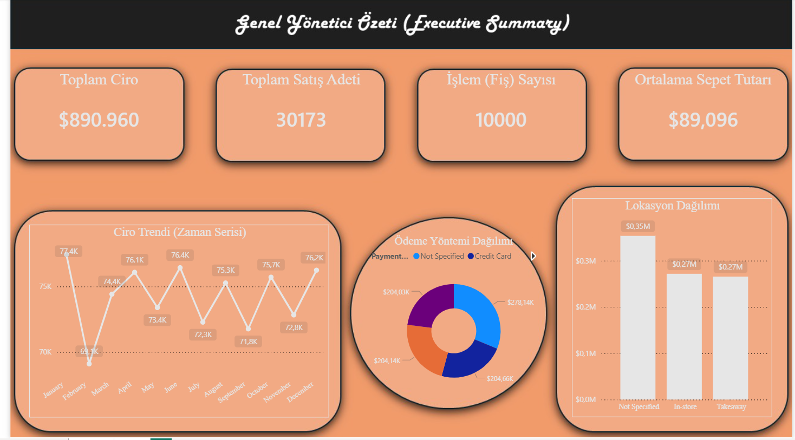
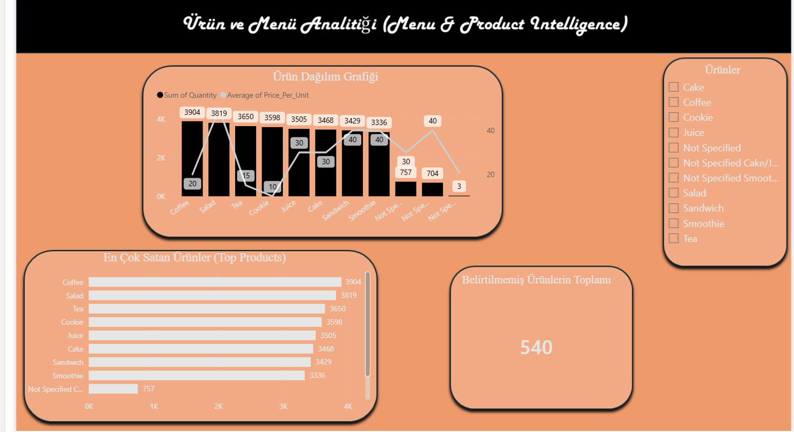

# ☕ Cafe Sales End-to-End Data Analysis Project

Bu proje, Kaggle üzerinde yer alan yapay bir kafe satış veri kümesinin (Cafe Sales Dataset), **Microsoft SQL Server (MSSQL)** kullanılarak veri temizleme (Data Cleaning) ve manipülasyonu süreçlerinden geçirilmesini ve ardından **Power BI** ile iş zekası raporuna dönüştürülmesini kapsayan uçtan uca (end-to-end) bir veri analitiği projesidir.

---

## 📌 Proje Amacı
Bir kafenin satış verilerindeki eksiklikleri, tutarsızlıkları ve mantıksal hataları iş kurallarına (business rules) göre temizlemek, finansal veri kaybını önlemek ve kafe yönetiminin stratejik kararlar (menü optimizasyonu, şube bazlı performans analizi, ciro trendleri) almasını sağlayacak dinamik bir dashboard oluşturmaktır.

---

## 🛠️ Kullanılan Teknolojiler ve Araçlar
* **Veritabanı Yönetimi:** Microsoft SQL Server (MSSQL)
* **Veri Görselleştirme & BI:** Power BI Desktop
* **Sorgulama Dili:** T-SQL (Data Cleaning, Imputation, Views)

---

## 💾 1. Aşama: SQL ile Veri Temizleme & Doğrulama (Data Cleaning)

Ham veri seti veritabanına `dirty_cafe_sales` adıyla yüklenmiş, ardından veri bütünlüğünü korumak adına bir kopyası (`cleaned_cafe_sales`) oluşturularak temizlik adımları T-SQL üzerinden yürütülmüştür.

### 🔍 Yapılan Analitik ve Mantıksal Düzenlemeler:

1. **Matematiksel Değer Kurtarma (Imputation):**
   * Ürünü belli olan ancak birim fiyatı (`Price_Per_Unit`) eksik olan satırlar, menüdeki sabit fiyat listesine göre (Örn: Coffee = 20, Salad = 50) `CASE WHEN` yapısıyla doldurulmuştur.
   * `Total_Spent` (Toplam Ciro) alanı boş olan satırlar, `Quantity * Price_Per_Unit` formülüyle geriye dönük hesaplanmıştır.
   * `Quantity` (Adet) alanı boş olan satırlar, `Total_Spent / Price_Per_Unit` mantığıyla kurtarılmıştır.

2. **Metinsel Hataların Giderilmesi:**
   * `Payment_Method` ve `Location` sütunlarında yer alan `NULL`, `'UNKNOWN'` ve `'ERROR'` gibi hatalı veriler, raporlama standartlarına uygun olarak `'Not Specified'` haline getirilmiştir.

3. **Gelişmiş Finansal İş Kuralları (Ciro Koruma):**
   * Kasaya para girişi olan (`Total_Spent` değeri var olan) ancak hangi ürünün kaç adet satıldığı bilinmeyen karmaşık satırlar silinmemiş; ciro kaybını önlemek adına bu satırlardaki ürün adı `'Unspecified'`, adet `1` ve birim fiyat `Total_Spent` değerine eşitlenerek sisteme kazandırılmıştır.
   * Hiçbir matematiksel ipucu taşımayan (cirosu ve adeti olmayan) tamamen kayıp satırlar ise `0` ve `'Not Specified'` olarak set edilerek nötrlenmiştir.

4. **Veri Kalite Kontrolü (Data Validation):**
   * Yapılan işlemlerin ardından tüm tablodaki `NULL` değer oranı kontrol edilmiş ve eksik veri sayısı **0 (Sıfır)** olana kadar doğrulanmıştır.

5. **Production Mimarisi ve View Oluşturma:**
   * Power BI raporunun veritabanındaki ham tablolardan etkilenmemesi ve performanslı çalışması amacıyla optimize edilmiş bir Raporlama Görünümü (**Reporting View**) oluşturulmuştur: `vW_Cleaned_Cafe_Sales`.

---

## 📊 2. Aşama: Power BI ile Veri Görselleştirme & İş Zekası

Temizlenen veri seti, oluşturulan SQL View aracılığıyla **Import** modunda Power BI'a aktarılmıştır. Rapor tasarımı, kullanıcı deneyimi (UI/UX) ön planda tutularak **Sıcak Kahve Teması** (Krem, Karamel ve Koyu Kahve tonları) ile 2 ana sayfa olarak tasarlanmıştır.

### 📄 Sayfa 1: Yönetici Özeti (Executive Summary)
Kafe yönetiminin genel gidişatı tek bakışta görmesini sağlayan bu sayfada şu yapılar kurulmuştur:
* **Ana KPI Kartları:** Toplam Ciro, Toplam Satış Adeti, Ortalama Sepet Tutarı ve Toplam İşlem (Fiş) Sayısı.
* **Ciro Trendi (Zaman Serisi):** Çizgi Grafiği (Line Chart) ile cironun zaman içerisindeki dalgalanmaları ve yoğun dönemleri analize sunulmuştur.
* **Şube ve Ödeme Dağılımı:** Çubuk ve Donut grafikler yardımıyla şubelerin (In-store, Takeaway) ciro payı ve müşterilerin ödeme alışkanlıkları gösterilmiştir.

--

### 📄 Sayfa 2: Ürün ve Menü Analitiği (Menu Intelligence)
Mutfak ve stok yönetimini optimize etmek amacıyla tasarlanmıştır:
* **İki Eksenli Çizgi ve Kümelenmiş Sütun Grafiği:** Ürünlerin satış adetleri (popülerlik) sütunlarla büyükten küçüğe sıralanırken, üzerlerine çekilen çizgiyle ortalama birim fiyatları çakıştırılmıştır. Bu sayede "Sürümden Kazandıran (Cash Cows)" ürünler ile "Yıldız (Stars)" ürünler net bir şekilde ayrıştırılmıştır.
* **Lokasyon Bazlı Ürün Tercihi:** Kümelenmiş sütun grafiği ile hangi şubede (Örn: Gel-al şubesi) hangi ürün kombinasyonlarının daha çok tercih edildiği filtrelenmiştir.
* **Veri Kalitesi ve Risk İzleme Kartı:** SQL aşamasında kurtarılan ve `'Not Specified'` olarak etiketlenen eksik girilmiş ciroların, toplam şirket cirosunun yüzde kaçını oluşturduğu DAX ölçüleri (`Measure`) yazılarak bir Kalite Kartı altında izlenmeye alınmıştır.

--

Analist Özeti
Temizlenen veri seti ve oluşturulan dinamik dashboard'lar üzerinden kafe yönetimi için kritik önem taşıyan şu stratejik bulgular elde edilmiştir:
* **Finansal Risk Yönetimi & Veri Kalitesi:** SQL aşamasında silinmeyip sisteme kazandırılan eksik veriler (`Not Specified`), toplam şirket cirosunun küçük ama göz ardı edilemeyecek bir kısmını oluşturmaktadır. Bu durum, kasa sistemindeki (POS) veri giriş standartlarının (özellikle ürün detayı girme zorunluluğunun) artırılması gerektiğine işaret etmektedir.
* **Menü ve Fiyat Stratejisi (Sürüm vs. Kar Marjı):** İki eksenli analize göre `Coffee` ve `Tea` gibi ürünlerin birim fiyatları düşük olmasına rağmen, devasa satış adetleri ile kafenin nakit motoru (Cash Cow) olduğu kanıtlanmıştır. Buna karşın `Salad` hem yüksek fiyat hem de yüksek talep ile en karlı "Yıldız" ürünler olarak öne çıkmaktadır.
* **Lokasyon Bazlı Tüketim Alışkanlıkları:** Paket servis (`Takeaway`) şubesinde hızlı tüketilen sandviç ve kahve kombinasyonları zirvedeyken, kafe içi (`In-store`) oturumlarda çay ve tatlı tüketiminin yoğunlaştığı görülmüştür. Bu bulgu, şube bazlı stok ve vitrin yönetiminin optimize edilmesini (Örn: Paket servis noktalarında sandviç stokunun artırılması) gerekli kılmaktadır.
* **Ödeme Alışkanlıkları:** Dijital cüzdan ve kredi kartı kullanım oranlarının dağılımı, kafe kasalarındaki temassız ödeme altyapısının her şubede kusursuz çalışması gerektiğini, nakit yönetim maliyetlerinin ise minimuma indirilebileceğini göstermektedir

### İletişim
Bu proje ile ilgili sorularınız veya önerileriniz için benimle [LinkedIn profilim](https://www.linkedin.com/in/deniz-bal-64838b225) üzerinden iletişime geçebilirsiniz.
